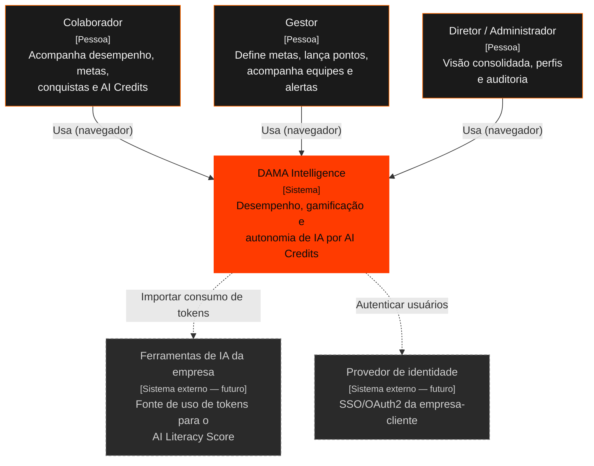

# C4 — Nível 1: Contexto

```mermaid
flowchart TB
    colaborador["Colaborador<br/><small>[Pessoa]</small><br/>Acompanha desempenho, metas,<br/>conquistas e AI Credits"]
    gestor["Gestor<br/><small>[Pessoa]</small><br/>Define metas, lança pontos,<br/>acompanha equipes e alertas"]
    diretor["Diretor / Administrador<br/><small>[Pessoa]</small><br/>Visão consolidada, perfis<br/>e auditoria"]

    dama["DAMA Intelligence<br/><small>[Sistema]</small><br/>Desempenho, gamificação e<br/>autonomia de IA por AI Credits"]

    ferramentas["Ferramentas de IA da empresa<br/><small>[Sistema externo — futuro]</small><br/>Fonte de uso de tokens para o<br/>AI Literacy Score"]
    sso["Provedor de identidade<br/><small>[Sistema externo — futuro]</small><br/>SSO/OAuth2 da empresa-cliente"]

    colaborador -- "Usa (navegador)" --> dama
    gestor -- "Usa (navegador)" --> dama
    diretor -- "Usa (navegador)" --> dama
    dama -. "Importar consumo de tokens" .-> ferramentas
    dama -. "Autenticar usuários" .-> sso

    classDef pessoa fill:#1a1a1a,stroke:#ff6a00,color:#f2f2f2
    classDef sistema fill:#ff3b00,stroke:#ff3b00,color:#0b0b0b
    classDef externo fill:#2a2a2a,stroke:#777,color:#cfcfcf,stroke-dasharray:4 3
    class colaborador,gestor,diretor pessoa
    class dama sistema
    class ferramentas,sso externo
```

Linhas tracejadas: integrações previstas e ainda não implementadas.
