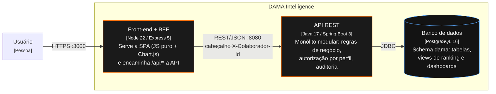

# C4 — Nível 2: Contêineres

| Contêiner | Pasta | Imagem / porta | Saúde |
|---|---|---|---|
| Front-end + BFF | `frontend/` | `node:22-alpine`, 3000 | `GET /health` (verifica também a API) |
| API | `backend/` | `eclipse-temurin:17-jre`, 8080 | `GET /actuator/health` |
| Banco | `database/` (scripts) | `postgres:16`, 5432 | `pg_isready` |

O navegador nunca fala direto com a API: tudo passa pelo BFF, que preserva o caminho `/api/*` e o cabeçalho de identificação do usuário.
