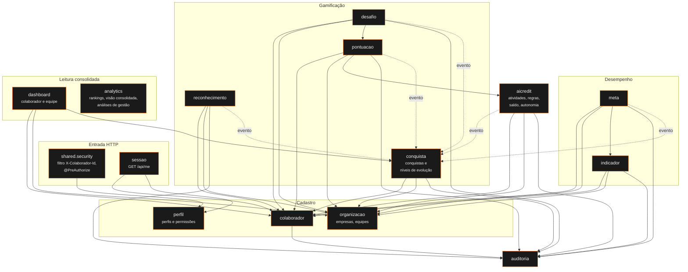

# C4 — Nível 3: Componentes do backend

Cada caixa é um módulo em `backend/src/main/java/br/com/dama/intelligence/<módulo>`. Setas contínuas são chamadas à `Facade` de outro módulo; a seta tracejada é o evento de domínio `DesempenhoAtualizadoEvent`.



## Regras de dependência

- Um módulo só importa o pacote `api` de outro (Facade, Views, Commands). Classes de `internal` são package-private.
- `analytics` não chama outros módulos: lê das views de `database/02_views.sql`.
- `conquista` não é chamado por quem gera pontos, metas etc.; ele escuta o evento `DesempenhoAtualizadoEvent` ([ADR-0007](../adr/0007-conquistas-por-eventos-de-dominio.md)).
- `auditoria` é chamado por todos os módulos que alteram dados (RF38).

## Estrutura de um módulo

```
meta/
├── api/
│   ├── MetaController.java      # endpoints REST + @PreAuthorize
│   ├── MetaFacade.java          # contrato público do módulo
│   ├── MetaView.java            # records de saída
│   └── CreateMetaCommand.java   # records de entrada (Bean Validation)
└── internal/
    ├── MetaService.java         # regras de negócio (implementa a Facade)
    └── MetaRepository.java      # SQL via JdbcTemplate
```
